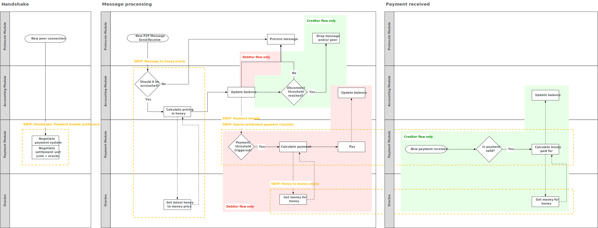

## Simple summary 
Swarm needs a mechanism to allow fluctuation of the exchange rate between honey (Swarm's internal accounting unit) and the currency used to pay for transferring data. This SWIP proposes an on-chain price oracle that provides an exchange rate with an associated expiration.

## Abstract 
The ability to update prices is required in order to:
* Facilitate experimentation with the absolute price of honey (e.g. start at a low price and gradually increase);
* Off-set fluctuations of the currency used to pay;
* Lower the price of Swarm in the long-run as the costs of operating a Swarm node decrease.

The proposal is an on-chain price oracle that returns the current exchange rate when queried. The price oracle will be initially managed by Swarm developers and stakeholders.

This SWIP is part of a series of SWIPs (but can be implemented on its own). To see the full picture, please refer to [swip-message_to_honey](./swip-message_to_honey.md), [swip-multiple](./swip-honey_to_money.md), [swip-multiple_payment_processing_support](./swip-multiple_payment_processing_support.md) and the diagram below:

## Motivation
Nodes keep track of relative balances to each other using an imaginary currency: honey. Since honey is not a currency in which nodes can settle their balances with each other–it is merely a unit of accounting–there is a requirement to facilitate converting honey to a currency. Furthermore, it is desirable that this conversion rate can fluctuate since:

* The Swarm developers plan to initially set the price of honey very low but progressively increase it, to the point where it is sufficiently high to incentivize nodes to offer their service to the network while being low enough not to scare away potential users of Swarm. 
* The price of the counterpart currency is expected to fluctuate in value against the costs of operating a Swarm node. As the real benefits (i.e. the worth of your compensation) of operating a Swarm node shouldn't fluctuate, the honey price should fluctuate inversely against the fluctuations of currency. If this happens, the real benefit stays equal, regardless of price fluctuations of the currency in which compensation is paid. 
* The costs of operating a Swarm node are expected to decrease over time, as hardware becomes cheaper, the code more optimized, etc. The price of honey is therefore expected to decrease to stay competitive with other storage solutions. 

This update process should be atomic: either all nodes upgrade or none of them do. If prices were updated in the Swarm source code (as is currently the case) it follows that while not all nodes are on the same release, nodes with [...] By externalising the price to an oracle, the basic functioning of Swarm–which is heavily focused on data availability, delivery, and security considerations–can be completely decoupled from price discovery. By building support for price oracles, price changes can be coordinated across the network, and set the stage for future experimentation with various mechanisms for setting prices; from DAOs, to bonding curves, to fixed prices. This SWIP makes no recommendation for the eventual pricing mechanism, it only prepares the network for adopting them in future.

In the current implementation honey prices are hardcoded. When this price changes in the codebase, it does not affect previous releases; an old release expects a settlement of honey to be worth a different amount in currency. Eventually, this will result in nodes which run different versions of the software disconnecting from each other, as the difference in prices will cause balances to be updated differently on each node. This SWIP proposes an on-chain price oracle to enable an atomic update process of honey prices without requiring nodes to update their source-code.

## Specification
* The Swarm source code will reference the address of a `HoneyToMoney` price oracle
* The price oracle implements the `HoneyToMoney` interface (to be specified) 
* The `HoneyToMoney` contract will be initially owned by an M/N multi-sig of Swarm developers and stakeholders.
* Before sending a payment (denominated in currency) a node will query the `HoneyToMoney` price oracle to get the most up-to-date price conversion. 
* Upon receiving a payment, nodes will determine the honey amount paid by looking up and dividing by the currently valid price from the oracle. This might cause payment imbalances between nodes, as the oracle might be queried one or several blocks before the transaction is sent. To avoid this situation it is proposed that nodes include a payload with the transaction, specifying the time at which the oracle was queried.

## Rationale
We need a way for prices in the Swarm to change over time. However, due to the nature of Swarm - specifically independent connections between pairs of nodes each with their individual accounting and payments - there is no clear price discovery mechanism. Furthermore, since Swarm nodes are expected to be conduits for both payments and data (buy from one peer and sell to the other) it is necessary for nodes to coordinate price changes with all their peers. In short, we need a mechanism for network-wide changes in pricing that the peer-to-peer routing and accounting does not provide.
By externalising the price to an oracle, we can completely decouple the basic functioning of Swarm - which is heavily focused on data availability, delivery, and security considerations - from the price discovery. By building support for price oracles, we can coordinate price changes across the network, and set the stage for future experimentation with various mechanisms for setting prices, from DAOs, to bonding curves, to fixed prices. This SWIP makes no recommendation for the eventual pricing mechanism, it only prepares the network for adopting them in future.

## Backwards Compatibility 
This SWIP is backwards compatible as long as the price oracle quotes the same prices as is currently hard-coded in non-upgraded Swarm nodes. It is up to the owner of the `MsgToHoney` oracle to ensure that prices are not updated too much while not all nodes run the new Swarm version. Currently, the Swarm is not running a live test net for settling prices, so no problems are expected with this SWIP if it's implemented before Swarm goes live with price-incentivization. 

## Test Cases
Not currently available

## Implementations 
Not currently available

## Copyright Waiver
 Copyright and related rights waived via [CC0](https://creativecommons.org/publicdomain/zero/1.0/).
